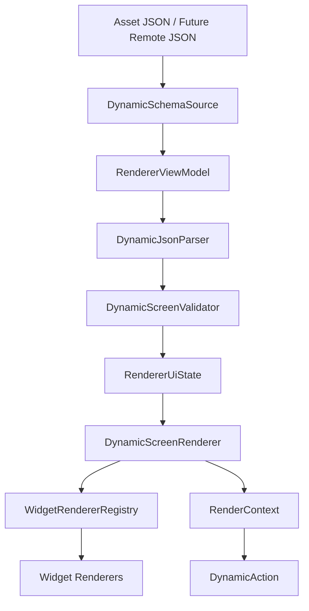
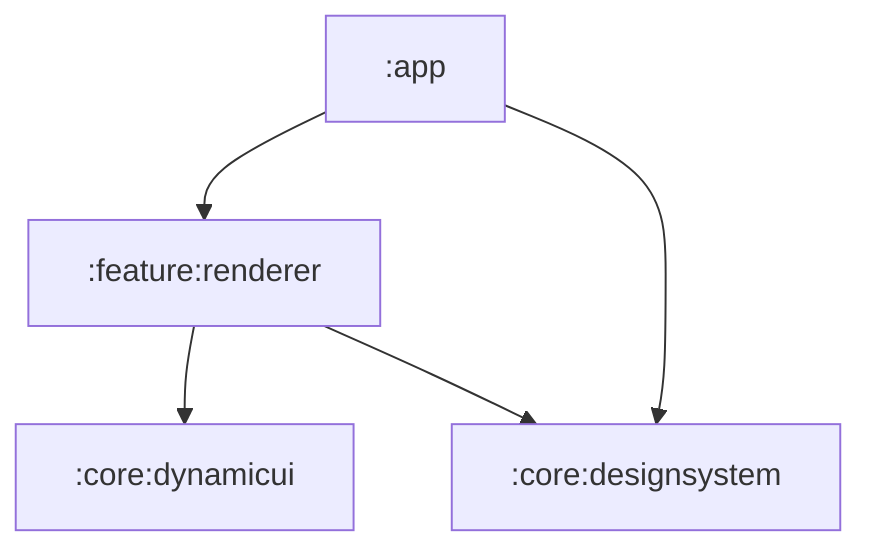

# DynamicUI Studio

[](https://github.com/kirklazar-android/dynamic-ui-studio-android/actions/workflows/android-ci.yml)


DynamicUI Studio is a modular Android portfolio project that demonstrates backend-driven UI rendering with Kotlin and Jetpack Compose. Screens are described as JSON schemas, validated at runtime, and rendered through a widget registry instead of hardcoded screen layouts.

## Overview

The project explores how Android teams can render server-controlled UI safely while keeping the renderer deterministic, testable, and extensible. The current implementation focuses on the foundation:

- JSON-based screen schema parsing
- Schema validation before rendering
- Widget registry-based Compose rendering
- MVVM renderer state management
- Dynamic action models
- Mock AI schema generation behind an interface
- Unit-tested core parser, validator, and AI generator behavior

## Problem Statement

Mobile apps usually require a new app release for layout and content changes. Backend-driven UI systems reduce that dependency by moving parts of the screen definition to a schema contract. This enables faster experimentation, campaign screens, onboarding variants, and personalized flows while still requiring strong validation and fallback behavior.

## Why Backend-Driven UI?

Backend-driven UI is useful when product teams need controlled runtime changes without constantly shipping app binaries. The tradeoff is that UI failures move from compile time to runtime, so the client must enforce a strict allowlist of widgets, actions, schema versions, and validation rules.

DynamicUI Studio demonstrates that balance: schemas are flexible, but rendering is only allowed after parsing and validation.

## Key Features

- Render Compose screens from JSON schemas.
- Keep widget rendering extensible through `WidgetRendererRegistry`.
- Validate schema structure, widget IDs, action payloads, and unsupported types.
- Load bundled schemas through a source abstraction.
- Track renderer state with `RendererViewModel` and `StateFlow`.
- Keep AI generation separate from rendering through `AiSchemaGenerator`.

## Architecture



## Module Structure



| Module | Responsibility |
|---|---|
| `:app` | Android entry point, navigation host, app resources |
| `:core:designsystem` | Compose Material 3 theme and shared visual foundation |
| `:core:dynamicui` | Schema models, parser, validation, action models, AI schema contract |
| `:feature:renderer` | Renderer screen, ViewModel, schema source, widget registry and renderers |

## JSON Schema Example

```json
{
  "screenId": "credit_card_onboarding",
  "title": "Credit Card Onboarding",
  "version": 1,
  "analytics": {
    "screenView": "cc_onboarding_viewed"
  },
  "layout": {
    "type": "vertical",
    "padding": 20,
    "widgets": [
      {
        "id": "hero_title",
        "type": "text",
        "text": "Get your new credit card in minutes",
        "style": "headlineLarge"
      },
      {
        "id": "apply_cta",
        "type": "button",
        "text": "Apply Now",
        "action": {
          "type": "show_snackbar",
          "message": "Application flow will be connected next"
        }
      }
    ]
  }
}
```

The bundled sample lives at `app/src/main/assets/screens/home.json`.

## Supported Widgets

| Widget | Status | Notes |
|---|---|---|
| Text | Supported | Headline, title, body, caption styles |
| Button | Supported | Can dispatch dynamic actions |
| Card | Supported | Supports nested widgets |
| List | Supported | Renders simple text lists |
| Spacer | Supported | Schema-controlled vertical spacing |
| Divider | Supported | Material horizontal divider |
| Image | Planned | Will use Coil with content descriptions |
| Input Field | Planned | Needed for dynamic forms |
| Carousel | Planned | Useful for richer product demos |

## Supported Actions

| Action | Status | Notes |
|---|---|---|
| `show_snackbar` | Supported | Demo action handled by the renderer |
| `navigate` | Modeled | Dispatcher integration planned |
| `open_url` | Modeled | Dispatcher integration planned |
| `track_analytics` | Modeled | Analytics tracker planned |
| `submit_form` | Planned | Will arrive with dynamic forms |
| `refresh_screen` | Planned | Will arrive with repository/fallback flow |

## Rendering Flow

```text
Schema source
  -> raw JSON
  -> DynamicJsonParser
  -> DynamicScreenValidator
  -> RendererUiState
  -> DynamicScreenRenderer
  -> WidgetRendererRegistry
  -> Compose widget renderers
```

## Validation Flow

Before a schema reaches Compose, the validator checks:

- Blank screen IDs and titles
- Unsupported schema versions
- Empty layouts
- Blank or duplicate widget IDs
- Unsupported widget types
- Missing required widget fields
- Invalid action payloads

Invalid schemas produce an error state instead of being rendered blindly.

## AI Schema Generation

AI is intentionally not part of runtime rendering. The app exposes `AiSchemaGenerator`, and the current `MockAiSchemaGenerator` produces validation-ready schemas without API keys.

Future real providers can implement the same interface:

```kotlin
interface AiSchemaGenerator {
    suspend fun generateSchema(prompt: String): Result<DynamicScreenSchema>
    suspend fun improveSchema(schemaJson: String, instruction: String): Result<DynamicScreenSchema>
}
```

The intended AI flow is:

```text
Prompt
  -> AI schema candidate
  -> parser
  -> validator
  -> preview
  -> renderer
```

## Demo

Screenshots and a short demo GIF are planned for the next visual polish pass. Suggested captures:

- Rendered credit card onboarding schema
- Nested card and list widgets
- Snackbar action handling
- Validation error state
- JSON schema beside rendered Compose UI

## Tech Stack

- Kotlin
- Jetpack Compose
- Material 3
- Android Gradle Plugin
- Kotlinx Serialization
- Coroutines and StateFlow
- Navigation Compose
- JUnit

## Testing Strategy

Current tests cover:

- Schema parsing
- Nested widget parsing
- Schema validation
- Duplicate widget ID validation
- Mock AI schema generation

Planned tests:

- Repository fallback behavior
- Remote failure to cache fallback
- Invalid schema UI state
- Dynamic action dispatch behavior
- Unsupported widget fallback rendering

## How To Run

Requirements:

- Android Studio
- Android SDK
- JDK compatible with the Android Gradle Plugin

Build and test:

```bash
./gradlew test assembleDebug
```

On Windows:

```powershell
.\gradlew.bat test assembleDebug
```

## Roadmap

- [x] Android app foundation
- [x] Dynamic schema model
- [x] JSON parser
- [x] Schema validator
- [x] Widget renderer registry
- [x] MVVM renderer screen
- [x] Mock AI schema generator
- [x] GitHub Actions CI
- [ ] Screenshots and demo GIF
- [ ] Analytics tracker abstraction
- [ ] Dynamic action dispatcher
- [ ] Remote schema source
- [ ] Cache-backed schema repository
- [ ] Image and input field widgets
- [ ] ViewModel and repository tests

## Why I Built This

I built DynamicUI Studio to demonstrate how Android apps can support server-controlled UI rendering without requiring an app release for every layout or content change. The project focuses on schema-driven rendering, modular architecture, widget extensibility, validation, action handling, and production-style concerns such as caching, analytics, and fallback states.
